<div align="center">



<br />

<a href="https://www.linkedin.com/in/burak-b%C3%BCy%C3%BCkdemirci-36002b308">
  
</a>
<a href="mailto:Burak.buyukdemirci@outlook.com">
  
</a>
<a href="https://github.com/BurakBuyukdemirci">
  
</a>


</div>

---

## About Me

```yaml
name: Burak Büyükdemirci
role: Software & AI Engineer
company: Likya Bilişim
education: Computer Engineering — Kütahya Dumlupınar University (GPA 3.76 / 4.00)
location: Ankara, Türkiye

specialization:
  - Full-stack web development (React · Next.js · Node.js)
  - Mobile & game development (Flutter · Unity)
  - SaaS platform architecture & multi-tier system design
  - AI-powered search, recommendation and data-analysis features
  - Relational database design (MSSQL · PostgreSQL)
  - REST APIs, third-party SDK & ad-network integrations

currently: shipping products end-to-end — architecture → build → store release → optimization
```

Computer Engineer working across software development, product ownership and enterprise
technology. I own products from the first architecture sketch to the store release: UI/UX,
database design, implementation, deployment and post-launch optimization. My background also
spans enterprise IT consulting and technical presales, which keeps me focused on the part
engineers sometimes skip — turning a business requirement into a system that holds up in production.

---

## Highlights

<div align="center">

<table>
  <tr>
    <td align="center" width="200">
      <h2>5</h2>
      <sub><b>MOBILE APPS</b><br />shipped to App&nbsp;Store &amp; Google&nbsp;Play</sub>
    </td>
    <td align="center" width="200">
      <h2>3</h2>
      <sub><b>WEB APPS</b><br />designed, built &amp; deployed</sub>
    </td>
    <td align="center" width="200">
      <h2>E2E</h2>
      <sub><b>PRODUCT OWNERSHIP</b><br />concept → release → iterate</sub>
    </td>
    <td align="center" width="200">
      <h2>3.76</h2>
      <sub><b>GPA / 4.00</b><br />Computer Engineering</sub>
    </td>
  </tr>
</table>

</div>

---

## Experience

<table>
  <tr>
    <td width="27%" valign="top">
      <br /><br />
      <b>Software Development Specialist</b><br />
      <sub>Jul 2025 — Present<br />Ankara, Türkiye · Full-time</sub>
    </td>
    <td valign="top">
      Driving full-cycle development of SaaS platforms, high-performance web applications and mobile products.
      <ul>
        <li><b>End-to-end mobile ownership</b> — built and launched 5 applications on the App Store and Google Play, independently managing UI/UX, database architecture, development and store releases.</li>
        <li><b>Web product development</b> — designed, developed and deployed 3 production-ready web applications, from system architecture to frontend implementation.</li>
        <li><b>SaaS &amp; full-stack</b> — architecting multi-tier SaaS platforms with React, Next.js and Node.js on top of MSSQL / PostgreSQL backends.</li>
        <li><b>AI &amp; algorithmic features</b> — intelligent search, data analysis and engagement systems.</li>
        <li><b>Integration architecture</b> — runtime-configurable systems that switch between third-party SDKs and ad networks without a rebuild.</li>
      </ul>
    </td>
  </tr>
  <tr>
    <td valign="top">
      <br /><br />
      <b>Technical Product &amp; IT Sales Manager</b><br />
      <sub>Feb 2026 — Present<br />Ankara, Türkiye · Hybrid</sub>
    </td>
    <td valign="top">
      Bridging software engineering with enterprise technology: solution design, B2B sales and IT procurement.
      <ul>
        <li>Technical solution design, configurations, BOMs and commercial proposals.</li>
        <li>Full sales lifecycle — pricing, supplier coordination, negotiation, procurement, fulfillment.</li>
        <li>Presales consulting: translating business needs into scalable, cost-effective architectures.</li>
        <li>Vendor, distributor and corporate client relationship management.</li>
      </ul>
    </td>
  </tr>
  <tr>
    <td valign="top">
      <br /><br />
      <b>Enterprise Sales Intern</b><br />
      <sub>Mar 2024 — Sep 2024<br />Arena · İstanbul, Türkiye</sub>
    </td>
    <td valign="top">
      Served as the bridge between technical engineering concepts and business solutions inside the Dell Technologies ecosystem.
      <ul>
        <li>Configured server, storage and workstation solutions against real customer infrastructure requirements.</li>
        <li>Streamlined project execution using Dell configuration tooling and CRM systems.</li>
        <li>Supported solution architecture and client presentations alongside sales and technical teams.</li>
      </ul>
    </td>
  </tr>
</table>

---

## Tech Stack

<table>
  <tr>
    <td align="center" width="190"><b>LANGUAGES</b></td>
    <td>
      
      
      
      
      
      
    </td>
  </tr>
  <tr>
    <td align="center"><b>FRONTEND</b></td>
    <td>
      
      
      
      
      
      
    </td>
  </tr>
  <tr>
    <td align="center"><b>BACKEND &amp; APIs</b></td>
    <td>
      
      
      
      
    </td>
  </tr>
  <tr>
    <td align="center"><b>MOBILE &amp; GAME</b></td>
    <td>
      
      
      
      
    </td>
  </tr>
  <tr>
    <td align="center"><b>DATA</b></td>
    <td>
      
      
      
      
      
    </td>
  </tr>
  <tr>
    <td align="center"><b>AI</b></td>
    <td>
      
      
      
      
      
    </td>
  </tr>
  <tr>
    <td align="center"><b>DESIGN</b></td>
    <td>
      
      
      
    </td>
  </tr>
  <tr>
    <td align="center"><b>ARCHITECTURE</b></td>
    <td>
      
      
      
    </td>
  </tr>
  <tr>
    <td align="center"><b>TOOLS</b></td>
    <td>
      
      
      
      
      
    </td>
  </tr>
</table>

---

## Focus Areas

<div align="center">


</div>

---

## GitHub Stats

<div align="center">


<picture>
  <source media="(prefers-color-scheme: dark)" srcset="https://raw.githubusercontent.com/BurakBuyukdemirci/BurakBuyukdemirci/output/github-contribution-grid-snake-dark.svg" />
  <source media="(prefers-color-scheme: light)" srcset="https://raw.githubusercontent.com/BurakBuyukdemirci/BurakBuyukdemirci/output/github-contribution-grid-snake.svg" />
  
</picture>

</div>

---

<div align="center">

## Contact

Open to **SaaS &amp; product engineering roles**, **AI-focused collaborations** and **enterprise technology projects**.

<a href="https://www.linkedin.com/in/burak-b%C3%BCy%C3%BCkdemirci-36002b308">LinkedIn</a>
&nbsp;·&nbsp;
<a href="mailto:Burak.buyukdemirci@outlook.com">Burak.buyukdemirci@outlook.com</a>
&nbsp;·&nbsp;
<a href="https://github.com/BurakBuyukdemirci">@BurakBuyukdemirci</a>

<br /><br />

<sub><i>Ankara, Türkiye · building things that ship</i></sub>

</div>
